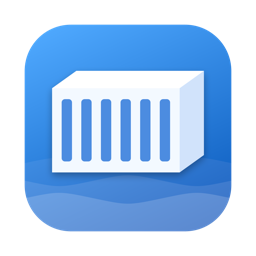
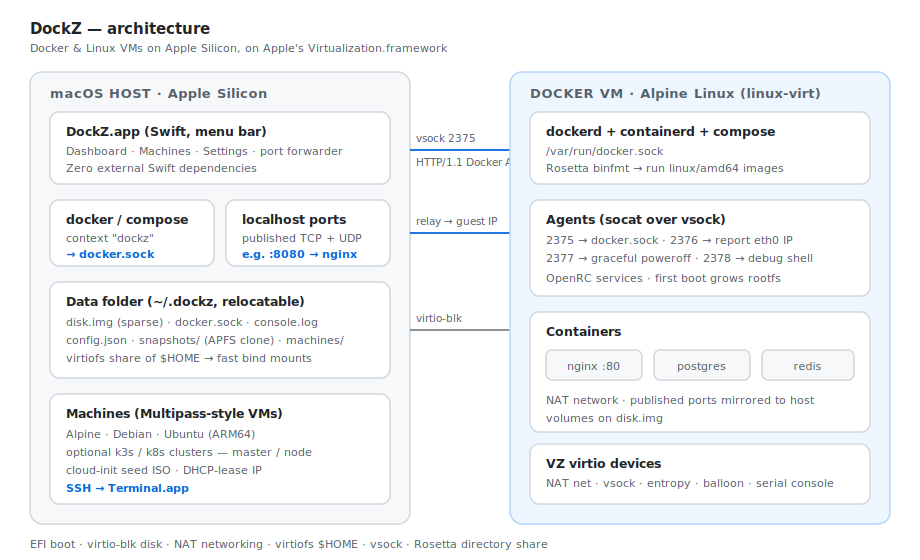
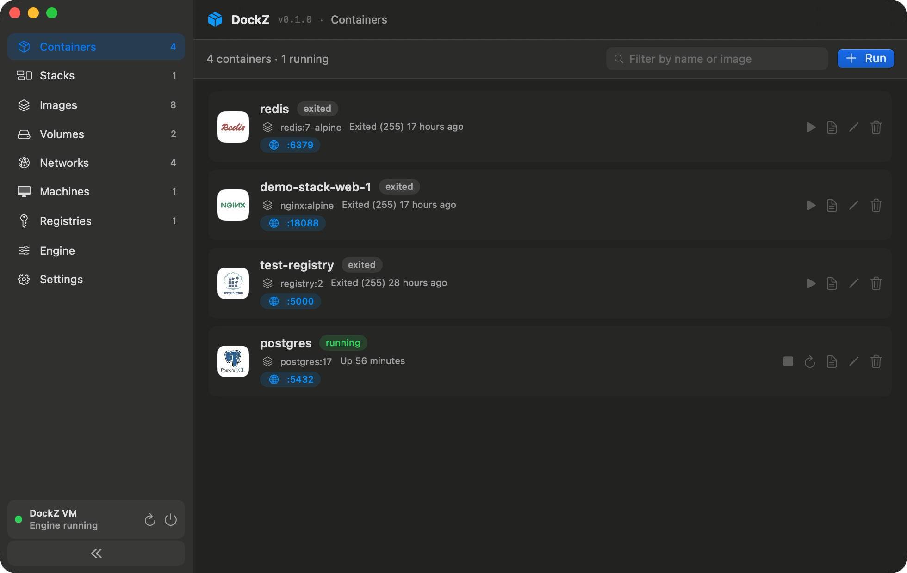
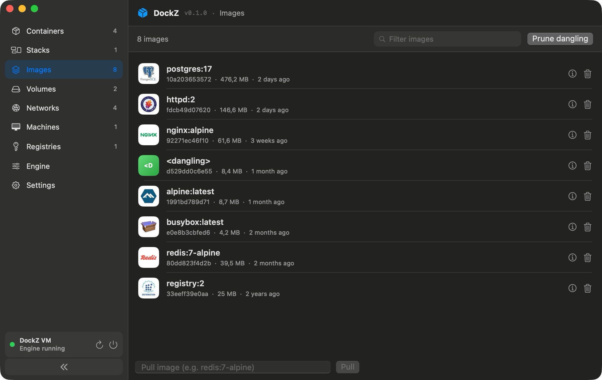
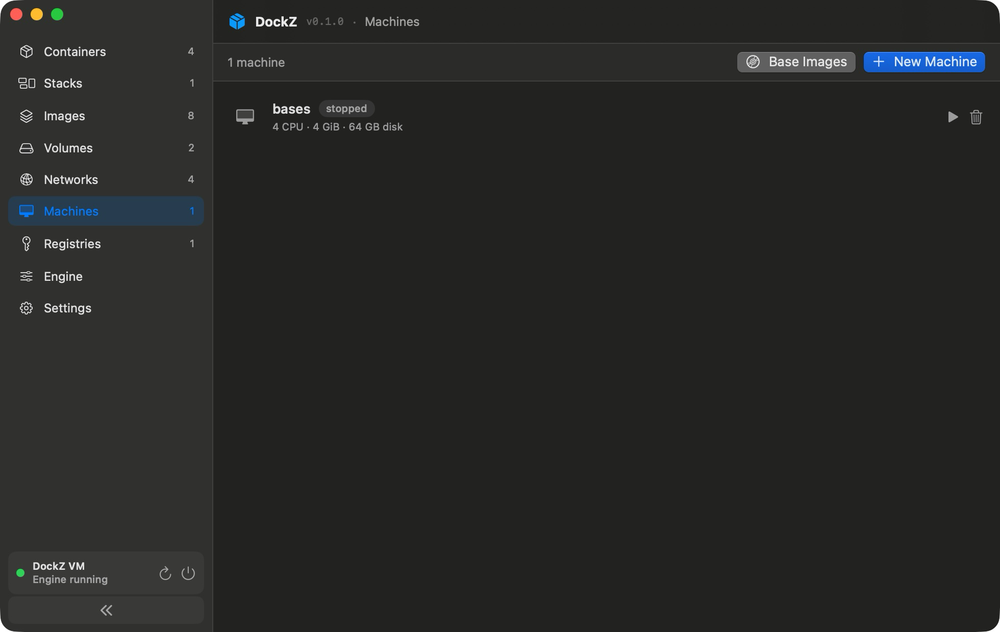
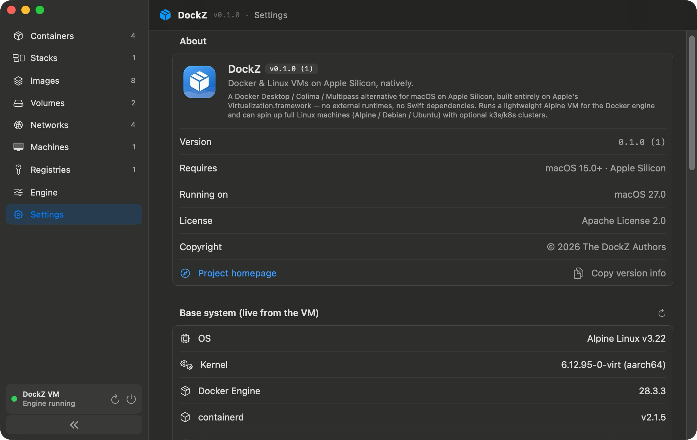

<p align="center">
  
</p>

<h1 align="center">DockZ</h1>

<p align="center"><b>Docker &amp; Linux VMs on Apple Silicon, natively.</b><br>
A ~5 MB menu bar app that boots the real <code>dockerd</code> in a tiny Alpine VM —<br>
plus a Docker Desktop–style dashboard and Multipass-style Linux machines.</p>

<p align="center">
  
  
  
  
</p>

<p align="center">
  <a href="#features">Features</a> ·
  <a href="#why-dockz">Why DockZ</a> ·
  <a href="#install--build">Install</a> ·
  <a href="#usage">Usage</a> ·
  <a href="#architecture">Architecture</a>
</p>

Built entirely on Apple's **Virtualization.framework** — no external runtimes,
no Swift dependencies, fully offline builds. The engine is exposed to the host
as a normal Docker context: `docker`, `docker compose`, and buildx just work.

<p align="center">
  
</p>

---

## Screenshots

|                       Containers                       |                    Images                    |
| :---------------------------------------------------: | :------------------------------------------: |
|         |        |
|                    **Machines**                       |              **Settings / About**            |
|             |    |

---

## Features

| | |
| --- | --- |
| 🐳&nbsp;**Real Docker engine** | Genuine `dockerd` in Alpine Linux, exposed as the `dockz` context — `docker`, `docker compose`, buildx all work. |
| 🖥️&nbsp;**Management dashboard** | Docker Desktop / Portainer style: containers, images, volumes, networks, registries, compose **stacks** — create/edit forms, live logs, stats, inspect. |
| 📦&nbsp;**Linux machines** | Multipass-style VMs (Alpine / Debian / Ubuntu, ARM64) over SSH, with one-click **k3s / k8s** master/node cluster templates. |
| 🚀&nbsp;**One-window onboarding** | First launch builds the guest image in a throwaway netboot VM and installs the CLI in parallel — when it closes, `docker ps` works. |
| 🔌&nbsp;**Auto port forwarding** | Published TCP + UDP ports mirrored on `localhost` by watching the Docker events API. |
| 📸&nbsp;**VM snapshots** | Instant APFS copy-on-write snapshots of the VM disk, with rollback. |
| 🔄&nbsp;**Rosetta** | Run `linux/amd64` images on Apple Silicon. |
| ⚙️&nbsp;**Configurable** | CPUs, memory, disk limit, `$HOME` virtiofs share, relocatable data folder (external SSD friendly). |
| 🧰&nbsp;**Docker CLI on demand** | No Homebrew: official static `docker` + compose fetched checksum-verified, terminal wired via a removable `~/.zshrc` block that steps aside for your own install. |
| 🪶&nbsp;**Zero dependencies** | Only Apple frameworks and in-repo code; builds offline with just the Command Line Tools. |

## Why DockZ?

**One 5 MB native app replaces the whole stack**: Docker engine + Docker
Desktop–style dashboard + Multipass-style Linux VMs + k3s/k8s playgrounds — free,
Apache-2.0, no accounts, no telemetry, no Electron.

What makes it different from the usual suspects:

- **Genuinely tiny and native.** The app bundle is ~5 MB of Swift/SwiftUI on
  Apple's Virtualization.framework. No Electron shell, no bundled node/qemu, no
  background updater. The 64 GB VM disk is APFS-sparse — a fresh engine really
  occupies ~1.3 GB.
- **Self-bootstrapping on an empty Mac.** The classic chicken-and-egg ("you need
  Docker to build the Docker VM image") is gone: first launch builds the guest
  image inside a throwaway Alpine netboot VM and fetches the official `docker` +
  compose CLIs in parallel, checksum-verified. No Homebrew, no admin password,
  no curl-pipe-bash.
- **Real `dockerd`, not a reimplementation.** 100 % engine compatibility —
  buildx, compose, registries, everything — because it *is* upstream Docker
  running in Alpine. The socket is bridged over vsock; published ports appear on
  `localhost` automatically (TCP + UDP).
- **Two products in one.** Containers *and* full Linux machines (Alpine, Debian,
  Ubuntu) with SSH, cloud-init, APFS instant clones, and one-click k3s/k8s
  master/node templates — the Docker Desktop *and* the Multipass use case,
  sharing one NAT network so multi-node clusters just work.
- **Ops niceties others gate or skip**: APFS copy-on-write VM snapshots with
  rollback, a relocatable data folder (move everything to an external SSD from
  Settings), Rosetta for `linux/amd64` images, private-registry credentials in
  the Keychain, graceful VM shutdown, and a plain-text `host.log` when you want
  to know exactly what the VM lifecycle did.
- **Auditable by one person in one sitting.** Zero external Swift dependencies —
  only Apple frameworks and the code in this repo. It builds offline with just
  the Command Line Tools.

### Comparison <sub>(macOS · Apple Silicon · mid-2026)</sub>

|                            |     **DockZ**      | Docker Desktop  |    OrbStack     |  Colima (Lima)  |    Multipass    |
| -------------------------- | :----------------: | :-------------: | :-------------: | :-------------: | :-------------: |
| 💵 License / price         | **Apache 2.0, free** | 💰 paid ≥ 250 staff | 💰 closed, paid commercial | MIT, free | free (Canonical) |
| 💾 App on disk             |     **~5 MB**      |    ~1.5 GB+     |   100s of MB    | CLI + brew deps |     ~350 MB     |
| 🎨 UI                      |  native SwiftUI    |    Electron     |     native      |    CLI only     |   minimal GUI   |
| 🐳 Docker engine           |  real `dockerd`    | real `dockerd`  | own stack       | real `dockerd`  |        —        |
| 🖥️ Dashboard (containers/stacks) |      ✅      |       ✅        |       ✅        |       ❌        |        —        |
| 📦 General Linux VMs       | ✅ + cloud-init    |       ❌        |       ✅        |    via lima     |       ✅        |
| ☸️ k8s out of the box      | ✅ multi-node k3s/k8s | single-node  |    ✅ (k8s)     |     manual      |       ❌        |
| 🔧 Install prerequisites   |     **none**       |  admin helper   |      none       |    Homebrew     |  installer pkg  |
| 📸 VM snapshots + rollback | ✅ APFS CoW        |       ❌        |       ❌        |       ❌        |       ✅        |
| 🔓 Open source             |   ✅ fully         |    partially    |       ❌        |       ✅        |       ✅        |

*Honest caveats*: DockZ is Apple Silicon + macOS 15+ only, young, not yet
notarized, and tuned for the common paths rather than every edge case. If you
need x86 Macs, Windows/Linux parity, or a vendor SLA, the incumbents above are
the safer pick — DockZ's lane is "everything a Mac developer needs, minus the
bloat and the license worries."

## Requirements

- macOS **15 (Sequoia) or later**
- **Apple Silicon** (M1 or newer)
- Command Line Tools or Xcode (to build from source)

**No Homebrew, no Docker Desktop, no admin password.** The dashboard talks to the
engine directly over vsock, so it needs no `docker` binary at all. Compose stacks
and container shells do — if the Mac has none, DockZ downloads the official static
`docker` CLI + compose plugin (≈48 MB) into its own data folder, verifying both
against pinned SHA-256 digests, makes `dockz` the default context, and adds a
conditional block to your shell rc so `docker ps` works in a new terminal. This
happens automatically during first-run setup (or later from
**Settings → Docker CLI**). An existing `docker` install is always preferred and
never touched.

## Install / Build

No full Xcode required — DockZ builds with Swift Package Manager and a bundling
script.

```bash
# Build + sign the host app  →  build/DockZ.app
scripts/build-and-bundle-app.sh
open build/DockZ.app
```

Copy `build/DockZ.app` into `/Applications` to install. On first launch DockZ
offers to build the guest disk image itself (a throwaway Alpine netboot VM
provisions it over the serial console — no Docker needed anywhere) and installs
the docker CLI in parallel if the Mac has none. Headless alternatives:

```bash
# Standalone image build (same path the setup window uses):
build/DockZ.app/Contents/MacOS/DockZ build-image
# Or, with any working Docker daemon already available:
guest/build-guest-image.sh            # installs <data folder>/disk.img
# CLI + compose + shell integration without the GUI:
build/DockZ.app/Contents/MacOS/DockZ install-docker-cli
build/DockZ.app/Contents/MacOS/DockZ setup-shell        # --remove to undo
```

## Usage

```bash
docker run --rm hello-world
docker run --rm -p 8080:80 nginx    # reachable at http://localhost:8080
```

When DockZ installed the CLI, `dockz` is already the default context. With your
own docker install, switch once: `docker context use dockz` (or per-command:
`docker --context dockz …`).

Open the dashboard from the menu bar icon (**Open Dashboard…**, ⌘D) to manage
containers, images, volumes, networks, registries, stacks, and machines, and to
adjust VM resources, snapshots, and the data folder in **Settings**.

## Architecture

- **Host app (Swift, menu bar)** — `sources/dockz/`
  - VZ VM: EFI boot → virtio-blk disk, NAT network, virtiofs share of `$HOME` at
    the same path (fast bind mounts), vsock, Rosetta directory share, memory
    balloon + entropy, serial console → `console.log`.
  - `docker.sock` — each client connection is bridged over vsock port 2375 to
    `dockerd`'s unix socket in the guest.
  - Port forwarding — subscribes to the Docker `/events` API, lists published
    TCP/UDP ports, and mirrors them on `localhost`, relaying to the guest IP.
  - Machines — cloud-init (NoCloud) seed ISOs for cloud images; APFS clone for
    instant creation; DHCP-lease parsing for machine IPs.
  - First-run bootstrap — a throwaway Alpine **netboot builder VM**, driven over
    its serial console by a tiny expect engine (`serial-expect.swift`),
    partitions and provisions `disk.img` from scratch; the provision script
    emits `DOCKZ-STEP` markers that drive the setup window's progress bar. In
    parallel, the CLI installer fetches `docker` + compose (SHA-256 pinned) and
    wires the user's shell rc.
  - Diagnostics — every VM lifecycle event (state changes, poweroff path,
    forced stops) is appended to `host.log` beside the guest's `console.log`.
- **Guest (Alpine)** — `guest/`
  - `linux-virt` kernel, grub arm64-efi (standalone, `--removable`), OpenRC,
    `dockerd` + compose plugin.
  - Agents are just `socat`: vsock 2375 → `/var/run/docker.sock`, 2376 → report
    `eth0` IP, 2377 → graceful poweroff, 2378 → debug shell.
  - First boot grows the root partition to fill the (sparse) disk.
  - Rosetta binfmt registration when the host shares the `rosetta` tag.

## Data files

Everything lives under the data folder (default `~/.dockz/`, relocatable in
Settings):

| File / dir     | Purpose                                                        |
| -------------- | -------------------------------------------------------------- |
| `disk.img`     | VM disk (sparse; grows up to the configured disk limit)        |
| `docker.sock`  | Host-side Docker socket (bridged to the guest over vsock)      |
| `console.log`  | Guest serial console — first stop for boot debugging           |
| `host.log`     | Host-side VM lifecycle log (state changes, stop/poweroff path) |
| `config.json`  | cpus, memoryGiB, diskLimitGB, shareHomeDirectory, enableRosetta |
| `bin/`, `docker-config/` | Managed docker CLI + its compose plugin and contexts |
| `snapshots/`   | VM disk snapshots + `index.json`                               |
| `machines/`    | Multipass-style Linux machines (`machines/bases/` = distro images) |

## Testing

The Command Line Tools don't ship XCTest, so tests run as an in-process
subcommand of the app binary:

```bash
swift run -c release DockzApp test    # exits non-zero on failure
```

CI runs the same on a `macos-15` runner (`.github/workflows/ci.yml`).

## Notes

- The app must be signed with the `com.apple.security.virtualization`
  entitlement or the VM won't start — `scripts/build-and-bundle-app.sh` handles
  this (Apple Development certificate, or ad-hoc as a fallback).
- Rebuilding the guest image wipes Docker data (`--force` guard).
- Not yet notarized — Gatekeeper may require right-click → Open on first launch,
  or `xattr -dr com.apple.quarantine /Applications/DockZ.app`.

## FAQ

**Is DockZ a free Docker Desktop alternative for Mac?**
Yes — free and Apache-2.0 licensed, with no per-seat licensing for companies.
It runs the real Docker Engine (`dockerd`) in a lightweight Alpine Linux VM on
Apple's Virtualization.framework.

**How is DockZ different from OrbStack or Colima?**
OrbStack is excellent but closed-source and paid for commercial use; Colima is
free but CLI-only and installed via Homebrew. DockZ is a ~5 MB fully
open-source native app with a GUI dashboard, needs no Homebrew and no admin
password, and also manages general-purpose Linux VMs. See the
[comparison](#why-dockz).

**Can I run Kubernetes (k3s/k8s) on it?**
Yes — the Machines tab creates Alpine/Debian/Ubuntu VMs with one-click k3s or
kubeadm master/node templates; nodes share one NAT network, so multi-node
clusters work on a single Mac.

**Does `docker compose` / buildx / amd64 work?**
Yes. The engine is upstream Docker, so compose, buildx, and private registries
behave exactly as on Linux. `linux/amd64` images run through Rosetta.

**Do I need Docker or Homebrew installed first?**
No. First launch builds the guest image itself and downloads the official
`docker` CLI + compose plugin, checksum-verified — a fresh Mac goes from zero
to `docker ps` in one window.

## License

DockZ is released under the [Apache License 2.0](LICENSE) — © 2026 The DockZ
Authors. See [NOTICE](NOTICE) for attribution.

Apache 2.0 was chosen for its explicit patent grant (protecting the project and
its users) and its "state changes" requirement on modified files.

The guest images DockZ builds bundle their own separately-licensed software
(Alpine Linux, Debian, Ubuntu, Docker, k3s, etc.); those retain their respective
upstream licenses.
