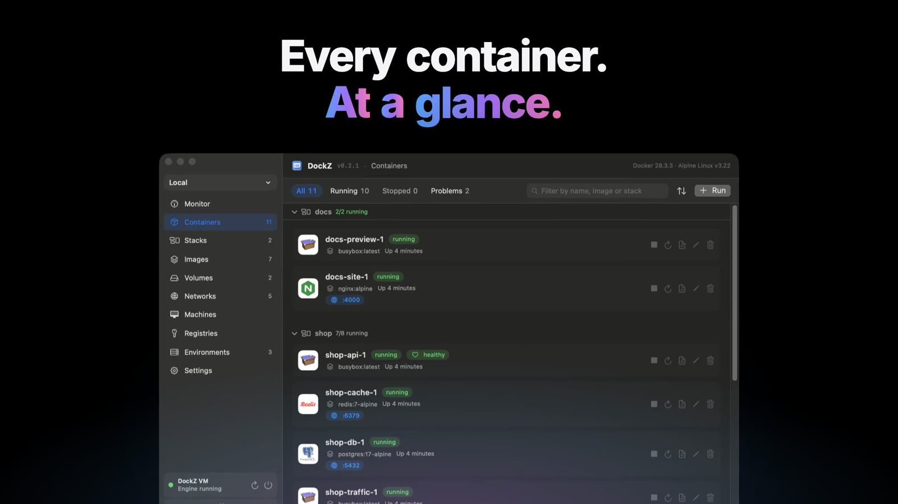
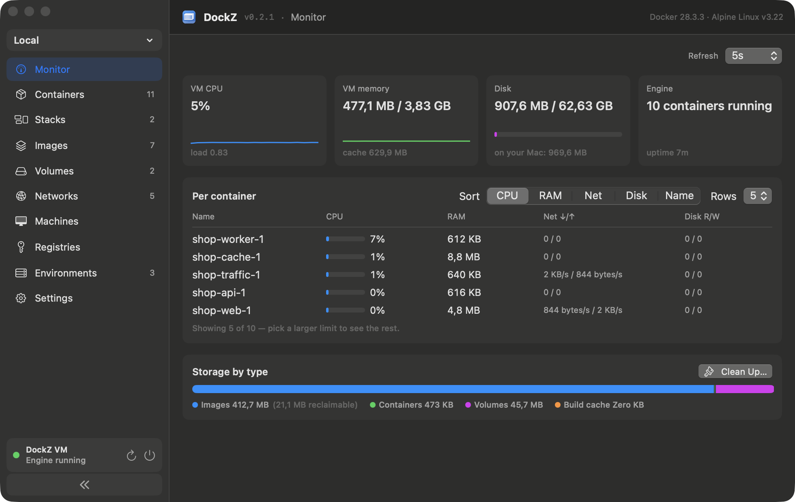
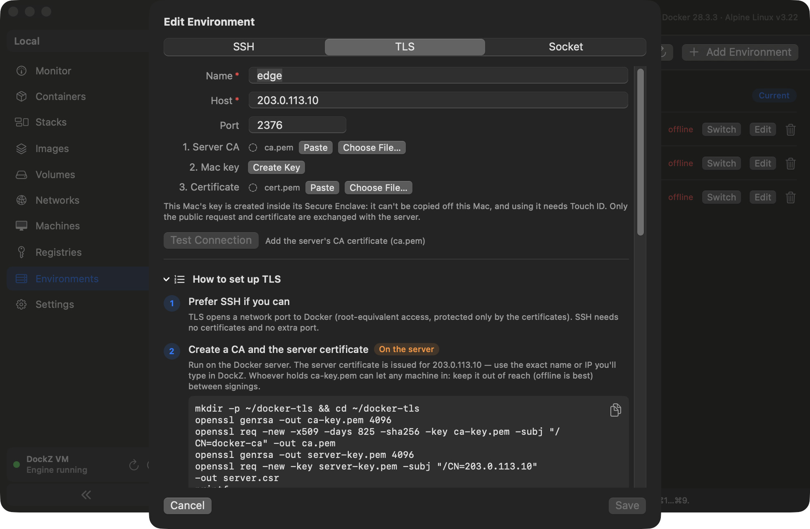

<p align="center">
  
</p>

<p align="center">Ứng dụng trên thanh menu, khởi động <code>dockerd</code> thật bên trong một VM Alpine siêu nhỏ —<br>
kèm dashboard kiểu Docker Desktop và các máy Linux kiểu Multipass.</p>

<p align="center">
  <a href="https://github.com/nextage-soft/dockz/releases/latest"></a>
  <a href="https://github.com/nextage-soft/dockz/actions/workflows/ci.yml"></a>
  
  
  
  
</p>

<p align="center">
  <a href="https://github.com/nextage-soft/dockz/releases/latest"><b>⬇️ Tải bản DMG mới nhất</b></a>
  &nbsp;·&nbsp; <a href="https://dockz.nextagesoft.com">Website</a>
  &nbsp;·&nbsp; <a href="CHANGELOG.md">Changelog</a>
  &nbsp;·&nbsp; <a href="docs/deployment-guide.md">Hướng dẫn ký ứng dụng</a>
</p>

<p align="center"><a href="README.md">English</a> · <b>Tiếng Việt</b></p>

<p align="center">
  <a href="#tính-năng">Tính năng</a> ·
  <a href="#vì-sao-chọn-dockz">Vì sao chọn DockZ</a> ·
  <a href="#cài-đặt--build">Cài đặt</a> ·
  <a href="#sử-dụng">Sử dụng</a> ·
  <a href="#kiến-trúc">Kiến trúc</a>
</p>

Xây dựng hoàn toàn trên **Virtualization.framework** của Apple — không runtime bên ngoài,
chỉ một dependency Swift (swift-nio-ssl của chính Apple, pin đúng phiên bản). Engine được đưa ra
máy host dưới dạng một Docker context bình thường: `docker`, `docker compose` và buildx chạy ngay.

<p align="center">
  <a href="https://dockz.nextagesoft.com/#video"></a><br>
  <sub>▶ <a href="https://dockz.nextagesoft.com/#video">Xem video giới thiệu 34 giây</a></sub>
</p>

<p align="center">
  
</p>

---

## Ảnh chụp màn hình

|                       Containers                       |                     Monitor                     |
| :---------------------------------------------------: | :---------------------------------------------: |
|         |         |
|        **Engine từ xa qua TLS (khoá trong Secure Enclave)**  |                  **Machines**                   |
|  |       |
|                       **Images**                       |               **Settings / About**              |
|                 |       |

<sub>Ảnh chụp màn hình dùng container demo và host giả lập (`10.0.0.5`, `203.0.113.10`).</sub>

---

## Tính năng

| | |
| --- | --- |
| 🐳&nbsp;**Docker engine thật** | `dockerd` chính gốc chạy trong Alpine Linux, được đưa ra dưới dạng context `dockz` — `docker`, `docker compose`, buildx đều chạy được. |
| 🖥️&nbsp;**Dashboard quản lý** | Phong cách Docker Desktop / Portainer: container, image, volume, network, registry, **stack** compose — form tạo/sửa, log trực tiếp, thống kê, inspect. Mọi danh sách đều có chip lọc phạm vi, tìm kiếm và sắp xếp; container được nhóm theo stack, container bị crash hoặc health check không đạt sẽ được đánh dấu (⌘F / ⌘R / ⌘N). |
| 📊&nbsp;**Monitor** | CPU, bộ nhớ, network và disk I/O theo thời gian thực cho từng container, các chỉ số sống còn của VM, phân tích dung lượng lưu trữ, và dọn dẹp image, volume và build cache không dùng đến. |
| 🌐&nbsp;**Nhiều environment** | Quản lý cả các Docker engine khác — host từ xa qua **SSH** hoặc **mutual TLS**, hay socket của một engine khác trên chính máy Mac này — và chuyển mọi tab giữa chúng ngay từ sidebar (⌘1…⌘9). Chỉ quản lý: không join hay chia sẻ gì cả. |
| 🛟&nbsp;**VM tự phục hồi** | Nếu dockerd ngừng phản hồi hoặc kernel của guest gặp lỗi, DockZ tự khởi động lại VM (có giới hạn để tránh crash loop) và giữ lại log console của những lần boot gần nhất. |
| 📦&nbsp;**Máy Linux** | VM kiểu Multipass (Alpine / Debian / Ubuntu, ARM64) truy cập qua SSH, kèm template cluster **k3s / k8s** master/node tạo chỉ bằng một cú click. |
| 🚀&nbsp;**Thiết lập ban đầu trong một cửa sổ** | Lần chạy đầu tiên build guest image trong một VM netboot dùng một lần rồi bỏ, đồng thời cài CLI song song — khi cửa sổ đóng lại, `docker ps` đã chạy được. |
| 🔌&nbsp;**Tự động port forwarding** | Các cổng TCP + UDP được publish sẽ tự xuất hiện trên `localhost` nhờ theo dõi Docker events API. |
| 📸&nbsp;**Snapshot VM** | Snapshot copy-on-write APFS tức thì cho ổ đĩa VM, có rollback. |
| 🔄&nbsp;**Rosetta** | Chạy image `linux/amd64` trên Apple Silicon. |
| ⚙️&nbsp;**Tuỳ chỉnh được** | Số CPU, bộ nhớ, giới hạn dung lượng đĩa, chia sẻ `$HOME` qua virtiofs, thư mục dữ liệu có thể chuyển chỗ (dùng tốt với SSD gắn ngoài). |
| 🧰&nbsp;**Docker CLI khi cần** | Không cần Homebrew: tải `docker` + compose bản static chính thức, có kiểm tra checksum; terminal được nối qua một khối cấu hình trong `~/.zshrc` có thể gỡ bỏ, và khối này tự nhường chỗ nếu bạn đã cài Docker riêng. |
| 🪶&nbsp;**Tối thiểu dependency** | Framework của Apple, code nằm ngay trong repo, và swift-nio-ssl mã nguồn mở của Apple (pin chính xác phiên bản) cho khoá TLS lưu trong Secure Enclave; chỉ cần Command Line Tools là build được. |

## Vì sao chọn DockZ?

**Một ứng dụng native 8 MB thay thế cả bộ công cụ**: Docker engine + dashboard kiểu Docker
Desktop + Linux VM kiểu Multipass + môi trường thử nghiệm k3s/k8s — miễn phí,
Apache-2.0, không cần tài khoản, không telemetry, không Electron.

Điều làm DockZ khác với những cái tên quen thuộc:

- **Thật sự nhỏ gọn và native.** App bundle chỉ khoảng ~8 MB (bản tải về 3.5 MB), viết bằng Swift/SwiftUI trên
  Virtualization.framework của Apple. Không vỏ Electron, không đóng gói kèm node/qemu, không
  trình cập nhật chạy nền. Ổ đĩa VM 64 GB là file sparse trên APFS — một engine mới tinh thực tế
  chỉ chiếm ~1.3 GB.
- **Tự khởi tạo trên một máy Mac trống trơn.** Bài toán con gà quả trứng kinh điển ("bạn cần
  Docker để build image VM cho Docker") đã được giải quyết: lần chạy đầu tiên build guest
  image bên trong một VM netboot Alpine dùng một lần rồi bỏ, đồng thời tải song song CLI `docker` +
  compose chính thức, có kiểm tra checksum. Không cần Homebrew, không cần mật khẩu admin,
  không curl-pipe-bash.
- **`dockerd` thật, không phải bản viết lại.** Tương thích engine 100 % —
  buildx, compose, registry, mọi thứ — vì nó *chính là* Docker upstream
  chạy trong Alpine. Socket được bắc cầu qua vsock; các cổng được publish tự xuất hiện trên
  `localhost` (TCP + UDP).
- **Hai sản phẩm trong một.** Container *và* máy Linux đầy đủ (Alpine, Debian,
  Ubuntu) với SSH, cloud-init, clone tức thì bằng APFS, và template k3s/k8s
  master/node chỉ một cú click — đáp ứng cả nhu cầu của Docker Desktop *lẫn* Multipass,
  dùng chung một mạng NAT nên cluster nhiều node chạy được ngay.
- **Những tiện ích vận hành mà công cụ khác bắt trả phí hoặc bỏ qua**: snapshot VM copy-on-write
  APFS có rollback, thư mục dữ liệu có thể chuyển chỗ (chuyển toàn bộ sang SSD gắn ngoài ngay từ
  Settings), Rosetta cho image `linux/amd64`, thông tin đăng nhập private registry lưu trong
  Keychain, tắt VM nhẹ nhàng (graceful), và file `host.log` dạng văn bản thuần khi bạn muốn
  biết chính xác vòng đời VM đã làm gì.
- **Một người có thể tự kiểm tra toàn bộ trong một lần ngồi.** Chỉ một dependency Swift bên ngoài —
  swift-nio / swift-nio-ssl của Apple, pin chính xác phiên bản (`Package.resolved`) và
  chỉ dùng để các environment TLS có thể giữ khoá trong Secure Enclave.
  Mọi thứ còn lại là framework của Apple và code trong repo này. Chỉ cần Command Line Tools
  là build được (lần build đầu sẽ tải các package).

### So sánh <sub>(macOS · Apple Silicon · giữa năm 2026)</sub>

|                            |     **DockZ**      | Docker Desktop  |    OrbStack     |  Colima (Lima)  |    Multipass    |
| -------------------------- | :----------------: | :-------------: | :-------------: | :-------------: | :-------------: |
| 💵 Giấy phép / giá         | **Apache 2.0, miễn phí** | 💰 trả phí khi ≥ 250 nhân sự | 💰 mã nguồn đóng, trả phí khi dùng thương mại | MIT, miễn phí | miễn phí (Canonical) |
| 💾 Dung lượng app trên đĩa |     **~8 MB**      |    ~1.5 GB+     |   hàng trăm MB  | CLI + các dependency của brew |     ~350 MB     |
| 🎨 Giao diện               |  SwiftUI native    |    Electron     |     native      |    chỉ có CLI   |   GUI tối giản  |
| 🐳 Docker engine           |  `dockerd` thật    | `dockerd` thật  | stack riêng     | `dockerd` thật  |        —        |
| 🖥️ Dashboard (container/stack) |      ✅      |       ✅        |       ✅        |       ❌        |        —        |
| 📦 Linux VM đa dụng        | ✅ + cloud-init    |       ❌        |       ✅        |    qua lima     |       ✅        |
| ☸️ k8s có sẵn              | ✅ k3s/k8s nhiều node | một node     |    ✅ (k8s)     | k3s một node (`--kubernetes`) |       ❌        |
| 🔧 Điều kiện cài đặt       |  **không cần gì**  |  helper quyền admin |   không cần gì  |    Homebrew     |  gói cài đặt (pkg) |
| 📸 Snapshot VM + rollback  | ✅ APFS CoW        |       ❌        |       ❌        |       ❌        |       ✅        |
| 🔓 Mã nguồn mở             |   ✅ hoàn toàn     |    một phần     |       ❌        |       ✅        |       ✅        |

*Nói thẳng những hạn chế*: DockZ chỉ chạy trên Apple Silicon + macOS 15 trở lên, còn non trẻ, các bản phát hành
chưa được notarize cho đến khi dự án thiết lập xong Developer ID (bạn cần cho phép một lần trong
System Settings), và được tinh chỉnh cho các tình huống phổ biến chứ không phải mọi trường hợp biên. Nếu bạn
cần Mac chip x86, tương đương trên Windows/Linux, hay SLA từ nhà cung cấp, thì các công cụ lâu năm ở trên là
lựa chọn an toàn hơn — đất của DockZ là "mọi thứ một lập trình viên Mac cần, bớt đi sự
cồng kềnh và nỗi lo giấy phép."

## Yêu cầu hệ thống

- macOS **15 (Sequoia) trở lên**
- **Apple Silicon** (M1 hoặc mới hơn)
- Command Line Tools hoặc Xcode (để build từ mã nguồn)

**Không cần Homebrew (tuỳ chọn, xem bên dưới), không cần Docker Desktop, không cần mật khẩu admin.** Dashboard giao tiếp
trực tiếp với engine qua vsock, nên hoàn toàn không cần file thực thi `docker`. Compose stack
và shell của container thì có cần — nếu máy Mac chưa có, DockZ sẽ tải CLI `docker` bản static
chính thức + plugin compose (≈48 MB) vào thư mục dữ liệu riêng của nó, kiểm tra cả hai
với mã SHA-256 đã pin sẵn, đặt `dockz` làm context mặc định, và thêm một
khối cấu hình có điều kiện vào file rc của shell để `docker ps` chạy được trong terminal mới. Việc này
diễn ra tự động trong lần thiết lập đầu tiên (hoặc sau đó từ
**Settings → Docker CLI**). Nếu đã có sẵn `docker` thì DockZ luôn ưu tiên dùng bản đó và
không bao giờ động vào.

## Cài đặt / Build

**Homebrew:**

```bash
brew tap nextage-soft/dockz https://github.com/nextage-soft/dockz
brew install --cask nextage-soft/dockz/dockz
```

Cập nhật bằng `brew upgrade --cask --greedy dockz` (cask luôn theo bản phát hành
mới nhất).

**Tải về:** lấy `DockZ-<version>.dmg` từ
[Releases](https://github.com/nextage-soft/dockz/releases), mở ra và kéo
DockZ vào Applications. Mỗi bản phát hành đều ghi kèm SHA-256 của DMG. Các bản build chưa
được notarize sẽ bị chặn ở lần mở đầu tiên — hãy cho phép DockZ một lần trong **System Settings →
Privacy & Security → Open Anyway**. Để ký DockZ bằng chứng chỉ của riêng bạn, hoặc
để phát hành bản đã ký + notarize, xem
[docs/deployment-guide.md](docs/deployment-guide.md).

**Build từ mã nguồn:** không cần Xcode đầy đủ — DockZ build bằng Swift Package
Manager và một script đóng gói.

```bash
# Build + sign the host app  →  build/DockZ.app
scripts/build-and-bundle-app.sh
open build/DockZ.app

# Optional: pack it as build/DockZ-<version>.dmg
scripts/make-dmg.sh
```

**Phát hành một bản release:** push một tag, ví dụ `v0.2.0`. Workflow *Release* sẽ
chạy test, build, đóng gói DMG (ký + notarize nếu các secret liệt kê ở
đầu `.github/workflows/release.yml` tồn tại) và đính kèm vào một GitHub
Release. Chạy workflow thủ công sẽ build một artifact DMG mà không phát hành.

Chép `build/DockZ.app` vào `/Applications` để cài đặt. Ở lần mở đầu tiên, DockZ
đề nghị tự build image đĩa cho guest (một VM netboot Alpine dùng một lần rồi bỏ sẽ
dựng nó qua serial console — không cần Docker ở bất kỳ đâu) và cài song song
docker CLI nếu máy Mac chưa có. Các cách chạy không cần giao diện:

```bash
# Standalone image build (same path the setup window uses):
build/DockZ.app/Contents/MacOS/DockZ build-image
# Or, with any working Docker daemon already available:
guest/build-guest-image.sh            # installs <data folder>/disk.img
# CLI + compose + shell integration without the GUI:
build/DockZ.app/Contents/MacOS/DockZ install-docker-cli
build/DockZ.app/Contents/MacOS/DockZ setup-shell        # --remove to undo
```

### Ký code (tự làm, không cần tài khoản trả phí)

Virtualization.framework từ chối khởi động VM nếu app không được ký với
entitlement `com.apple.security.virtualization`
([scripts/dockz.entitlements](scripts/dockz.entitlements)). Script build
tự động ký, chọn identity đầu tiên tìm thấy theo thứ tự:

1. `$SIGN_IDENTITY` nếu bạn export biến này,
2. nếu không, chứng chỉ **Apple Development** đầu tiên có trên máy,
3. nếu không nữa, chữ ký **ad-hoc** (`-`).

Cả ba đều chạy VM bình thường. Khác biệt là: chứng chỉ Apple Development
cho app một danh tính ổn định qua các lần build lại (macOS ghi nhớ các quyền đã cấp
như Local Network), còn ad-hoc thì vô danh — không gây hại gì, nhưng macOS
coi mỗi lần build lại là một app hoàn toàn mới. Bạn có thể tạo chứng chỉ Apple Development
miễn phí (không cần gói thành viên trả phí): Xcode → Settings → Accounts → thêm
Apple ID của bạn → Manage Certificates → **+** → Apple Development.

```bash
# See what's available, then pin one explicitly if you like:
security find-identity -v -p codesigning
SIGN_IDENTITY="Apple Development: you@example.com (TEAMID)" scripts/build-and-bundle-app.sh
```

**Chạy hoặc ký lại một bản release đã tải về** ("Open Anyway" của Gatekeeper,
`xattr`, ký bằng chứng chỉ của riêng bạn mà vẫn giữ entitlement
virtualization) được hướng dẫn từng bước trong
[docs/deployment-guide.md](docs/deployment-guide.md). Kiểm tra nhanh xem một bản
đã ký có boot được VM hay không:

```bash
codesign -d --entitlements - /Applications/DockZ.app   # must list …virtualization
```

## Sử dụng

```bash
docker run --rm hello-world
docker run --rm -p 8080:80 nginx    # reachable at http://localhost:8080
```

Nếu DockZ đã cài CLI, `dockz` sẵn là context mặc định. Nếu bạn dùng
bản docker tự cài, chỉ cần chuyển một lần: `docker context use dockz` (hoặc theo từng lệnh:
`docker --context dockz …`).

Mở dashboard từ biểu tượng trên thanh menu (**Open Dashboard…**, ⌘D) để quản lý
container, image, volume, network, registry, stack và machine; theo dõi
CPU, bộ nhớ và I/O của từng container (và dọn dẹp dung lượng đĩa) trong **Monitor**; thêm
các Docker engine khác trong **Environments** và chuyển sang chúng từ đầu
sidebar (⌘1…⌘9). Mọi danh sách đều có bộ lọc và tìm kiếm (⌘F, ⌘R để làm mới,
⌘N để tạo mới). **Settings** chứa tài nguyên VM, múi giờ, snapshot, thư mục
dữ liệu, và — trong mục **Advanced** — file `daemon.json` của engine.

## Kiến trúc

- **Host app (Swift, thanh menu)** — `sources/dockz/`
  - VZ VM: EFI boot → ổ đĩa virtio-blk, mạng NAT, chia sẻ `$HOME` qua virtiofs tại
    đúng đường dẫn đó (bind mount nhanh), vsock, chia sẻ thư mục Rosetta, memory
    balloon + entropy, serial console → `console.log`.
  - `docker.sock` — mỗi kết nối từ client được bắc cầu qua vsock cổng 2375 tới
    unix socket của `dockerd` trong guest.
  - Port forwarding — đăng ký lắng nghe API `/events` của Docker, liệt kê các cổng
    TCP/UDP được publish, và phản chiếu chúng lên `localhost`, chuyển tiếp tới IP của guest.
  - Machines — ISO seed cloud-init (NoCloud) cho cloud image; clone APFS để
    tạo tức thì; đọc DHCP lease để lấy IP của machine.
  - Khởi tạo lần đầu — một **VM builder netboot** Alpine dùng một lần rồi bỏ, được điều khiển qua
    serial console của nó bằng một expect engine nhỏ (`serial-expect.swift`),
    sẽ phân vùng và dựng `disk.img` từ đầu; script dựng máy phát ra
    các marker `DOCKZ-STEP` để điều khiển thanh tiến trình của cửa sổ thiết lập. Song
    song đó, trình cài CLI tải `docker` + compose (pin SHA-256) và
    nối vào file rc của shell người dùng.
  - Chẩn đoán — mọi sự kiện trong vòng đời VM (đổi trạng thái, đường poweroff,
    dừng cưỡng bức) đều được ghi nối vào `host.log` nằm cạnh `console.log` của guest.
- **Guest (Alpine)** — `guest/`
  - Kernel `linux-virt`, grub arm64-efi (standalone, `--removable`), OpenRC,
    `dockerd` + plugin compose.
  - Các agent chỉ là `socat`: vsock 2375 → `/var/run/docker.sock`, 2376 → báo
    IP của `eth0`, 2377 → poweroff nhẹ nhàng (graceful), 2378 → debug shell.
  - Lần boot đầu tiên mở rộng phân vùng root để lấp đầy ổ đĩa (sparse).
  - Đăng ký binfmt cho Rosetta khi host chia sẻ tag `rosetta`.

### Environments (các Docker engine khác)

Bộ chuyển environment trên sidebar trỏ mọi tab — Monitor, Containers,
Stacks, Images, Volumes, Networks — sang một engine khác. DockZ luôn mở ở
**Local**; environment từ xa có thanh tiêu đề màu cam và các hộp xác nhận thao tác
phá huỷ đều ghi rõ tên host. Machines chỉ dùng ở Local, và Settings luôn
cấu hình VM của chính máy Mac này.

| Loại | Bạn nhập gì | DockZ kết nối thế nào |
| --- | --- | --- |
| **SSH** | `user@host`, hoặc một alias trong `~/.ssh/config` | `/usr/bin/ssh … docker system dial-stdio`, giống `docker -H ssh://`. Dùng key, ssh-agent và ssh config của bạn (không lưu mật khẩu, chỉ xác thực bằng key). User ở máy từ xa phải chạy được `docker`. |
| **TLS** | host, port (2376), `ca.pem` của server, sau đó là chứng chỉ cho khoá của máy Mac này | Mutual TLS (swift-nio-ssl) tới một engine `dockerd --tlsverify`; chỉ tin CA đó và có kiểm tra tên/IP của server. |
| **Socket** | đường dẫn tới một unix socket | Một engine khác trên chính máy Mac này (Colima, OrbStack, Docker Desktop). |

Hộp thoại Add Environment có kèm hướng dẫn thiết lập từng bước cho mỗi loại
(cũng có thể in ra bằng `DockZ env-guide <ssh|tls|socket> <host> [port]`) và
giải thích nguyên nhân khi kết nối thất bại.

**Khoá TLS không bao giờ rời khỏi máy Mac.** DockZ tạo client key của mỗi environment TLS
bên trong Secure Enclave của máy Mac và chỉ hiển thị một yêu cầu ký chứng chỉ
(CSR); quản trị viên server ký nó bằng CA của họ (một lệnh duy nhất, hiển thị trong
hộp thoại) rồi dán chứng chỉ trở lại. Hệ quả:

- Không hề tồn tại file private key nào — không trong thư mục của DockZ, không trên server, không
  trong `~/Downloads`. Sao chép dữ liệu của DockZ, một bản backup hay cả ổ đĩa cũng không thu được gì
  dùng được; `client-key.se` chỉ là một handle mà chỉ con chip của chính máy Mac này dùng được.
- Dùng khoá cần Touch ID (hoặc mật khẩu đăng nhập), do con chip bắt buộc.
  Một lần xác nhận sẽ mở khoá environment cho đến khi màn hình khoá, máy Mac
  ngủ hoặc bạn chuyển sang environment khác; việc liệt kê environment không bao giờ hỏi xác nhận.
- Chứng chỉ client có hạn 90 ngày (dockerd không thể thu hồi riêng một chứng chỉ);
  gia hạn ngay từ hộp thoại. Máy Mac bị mất sẽ bị cắt quyền truy cập bằng cách thay CA của server.
- Docker CLI (compose, Shell) truy cập environment TLS qua một relay socket
  riêng tư mà DockZ phục vụ trong lúc environment đó đang được chọn (`$TMPDIR/dockz-cli/`, 0600)
  — CLI không bao giờ nhận được chứng chỉ hay khoá.
- App được ký với hardened runtime, nên code khác không thể bị
  inject vào DockZ để mượn quyền truy cập của nó.

Engine Windows cũng dùng được — container Windows được liệt kê và quản lý qua
cùng API đó; các tuỳ chọn chỉ dành cho Linux sẽ được ẩn đi với chúng.

Kiểm tra một environment từ terminal: `DockZ env-probe ssh user@host [port]`
(hoặc `tls <host> <port> <cert-dir> [--relay SECONDS]`, `socket <path>`). Bản probe
TLS đọc `ca.pem`, `cert.pem` và một `key.pem` từ thư mục được chỉ định —
nó dành cho các engine thử nghiệm.

## Tệp dữ liệu

Mọi thứ nằm trong thư mục dữ liệu (mặc định `~/.dockz/`, có thể chuyển chỗ trong
Settings):

| Tệp / thư mục  | Mục đích                                                       |
| -------------- | -------------------------------------------------------------- |
| `disk.img`     | Ổ đĩa VM (sparse; tăng dần tới giới hạn dung lượng đĩa đã cấu hình) |
| `docker.sock`  | Docker socket phía host (bắc cầu tới guest qua vsock)          |
| `console.log`  | Serial console của guest — nơi đầu tiên cần xem khi debug quá trình boot |
| `host.log`     | Log vòng đời VM phía host (đổi trạng thái, đường stop/poweroff) |
| `config.json`  | cpus, memoryGiB, diskLimitGB, shareHomeDirectory, enableRosetta |
| `bin/`, `docker-config/` | Docker CLI do DockZ quản lý + plugin compose và các context của nó |
| `environments.json`, `environments/<id>/` | Các Docker engine khác (0600); `ca.pem` / `cert.pem` công khai của environment TLS và handle khoá Secure Enclave `client-key.se` |
| `snapshots/`   | Snapshot ổ đĩa VM + `index.json`                               |
| `machines/`    | Máy Linux kiểu Multipass (`machines/bases/` = image của các distro) |

## Kiểm thử

Command Line Tools không đi kèm XCTest, nên test được chạy dưới dạng một subcommand
chạy ngay trong tiến trình của file thực thi app:

```bash
swift run -c release DockzApp test    # exits non-zero on failure
```

CI chạy đúng lệnh này trên runner `macos-15` (`.github/workflows/ci.yml`).

## Ghi chú

- App phải được ký với entitlement `com.apple.security.virtualization`,
  nếu không VM sẽ không khởi động — `scripts/build-and-bundle-app.sh` đã lo việc
  này (chứng chỉ Apple Development, hoặc ad-hoc nếu không có).
- Build lại guest image sẽ xoá sạch dữ liệu Docker (có chặn bằng `--force`).
- DMG của bản release chỉ được notarize khi repository có Developer ID và
  các secret cho notary ([docs/deployment-guide.md](docs/deployment-guide.md));
  nếu không, hãy cho phép DockZ một lần trong System Settings → Privacy & Security, hoặc chạy
  `xattr -dr com.apple.quarantine /Applications/DockZ.app`.

## Câu hỏi thường gặp

**DockZ có phải là lựa chọn thay thế Docker Desktop miễn phí cho Mac không?**
Có — miễn phí và theo giấy phép Apache-2.0, không tính phí theo số người dùng cho doanh nghiệp.
Nó chạy Docker Engine thật (`dockerd`) trong một VM Alpine Linux nhẹ trên
Virtualization.framework của Apple.

**DockZ khác OrbStack hay Colima thế nào?**
OrbStack rất tốt nhưng là mã nguồn đóng và phải trả phí khi dùng thương mại; Colima
miễn phí nhưng chỉ có CLI và cài qua Homebrew. DockZ là ứng dụng native ~8 MB, mã nguồn mở
hoàn toàn, có dashboard giao diện đồ hoạ, không cần Homebrew hay mật khẩu
admin, và còn quản lý được Linux VM đa dụng. Xem
[bảng so sánh](#vì-sao-chọn-dockz).

**Tôi có chạy được Kubernetes (k3s/k8s) trên đó không?**
Có — tab Machines tạo VM Alpine/Debian/Ubuntu với template k3s hoặc
kubeadm master/node chỉ một cú click; các node dùng chung một mạng NAT, nên cluster
nhiều node chạy được trên một máy Mac duy nhất.

**`docker compose` / buildx / amd64 có chạy được không?**
Có. Engine là Docker upstream, nên compose, buildx và private registry
hoạt động y hệt như trên Linux. Image `linux/amd64` chạy qua Rosetta.

**Tôi có cần cài Docker hay Homebrew trước không?**
Không. Lần chạy đầu tiên tự build guest image và tải CLI `docker` + plugin
compose chính thức, có kiểm tra checksum — một máy Mac mới tinh đi từ con số không
đến `docker ps` chỉ trong một cửa sổ.

## Giấy phép

DockZ được phát hành theo [Apache License 2.0](LICENSE) — © 2026 The DockZ
Authors. Xem [NOTICE](NOTICE) để biết thông tin ghi công.

Apache 2.0 được chọn vì điều khoản cấp quyền sáng chế rõ ràng (bảo vệ dự án và
người dùng) và yêu cầu "ghi rõ thay đổi" (state changes) đối với các file đã chỉnh sửa.

Các guest image mà DockZ build có đóng gói phần mềm theo giấy phép riêng của chúng
(Alpine Linux, Debian, Ubuntu, Docker, k3s, v.v.); những phần mềm đó giữ nguyên giấy phép
upstream tương ứng.
